Process Search (Beta)
=====================

Background
----------

Supporting D365/Dynamics CRM is time consuming but when it comes to finding out
which Workflow, Action, Dialog, Process Flow or Business Rules updates or
creates which Entity or Properties, it is annoying at best. This is compounded
by the number of Processes that the instance has.

There are a number of ways to handle it from opening each process and reviewing
it to using FetchXml or directly running SQL Queries. Which is helpful but can
be frustrating too.

But I thought to myself: self, there has to be a better way, why don’t I create
a XRMToolBox Plugin, and so I did.

Quick Start Notes
-----------------

Important: Please read [General Search](#general-search-considerations.) Section

Features
--------

### Searching

-   Entity

>   Search processes for Entities that are updated or created by a process

-   Properties

Search processes for Properties that are updated or created by a process

-   Steps

Search processes for text in a step comment.

-   Child Processes

Search processes that call a specific child process

### Grid features

-   Grouping and Sub Grouping

-   Excel like Filtering

-   Multi Column Sorting

-   Double click to open the Process

### In Memory Data

Sometimes an XTB plugin will continue to get data from the Org when searching. I
decided by loading the data in memory and then searching it locally on the
machine, it would result in faster searching at the expense of a longer initial
data load of the Entities, Properties and Processes. With the added benefit of
having the grid refresh faster. This also limits the data load on the server
where doing a complex search could possibly time out.

Usage
-----

### Loading Data

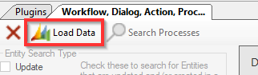

Initial load of the Entities, Properties and Processes. Can take up to a minute
depending on how many entities and processes there are in the Org.

### Searching

#### General search considerations.

##### Additive Search

Each selection on the search form is considered additive to the criteria, or
maybe better understood as using And, not Or. For example, an English language
query would be: Give me all Processes that Update and Create the Selected
Entity. In this case it returns one process

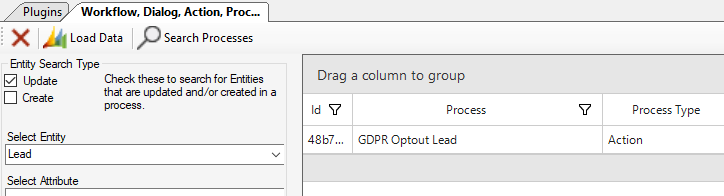

##### Grid Features

The other consideration is the idea of using the Grid features for Filtering,
Grouping and Sorting once you have returned some, or even, all the Processes.

In this case I used the search button to return all the Processes. Then using
the Grid capabilities, I am grouping by Process type, sorting by Name, and
filtering where they are not owned by SYSTEM.

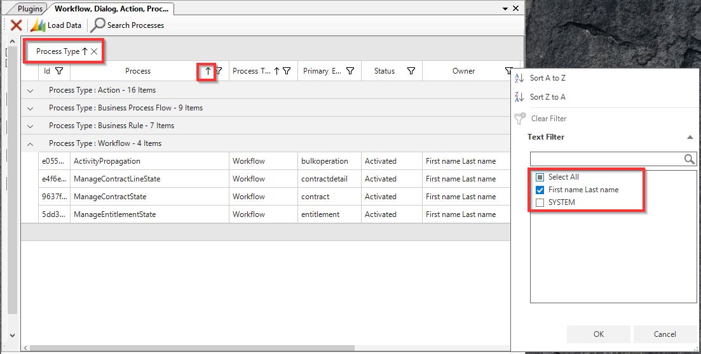

##### Loading Data

If you decided to hit the Load Data Button again it will retrieve all the
Entities, Properties and Processes from the server again. But also, it will
reset the Grid and Dropdown lists effectively erasing your search.

##### Search Button

The search button searches the locally stored process records in memory and
populates the grid while resetting the grid.

#### Search Features

##### Update and Create Search

The Update and Create search checkboxes allow you to search for Processes that
either update, create, or both update and create entities.

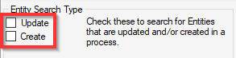

English query example: Give me all the Processes that both create and update any
entities. In that case I would check both checkboxes and click the Search
Button.

Which gives me no records back.

However, if I just use the Update Checkbox then I get seven records back.

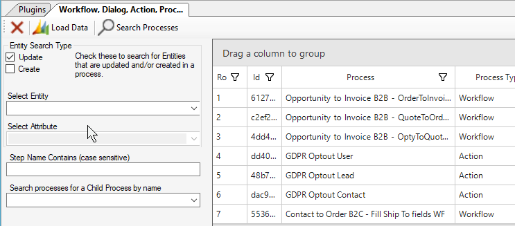

##### Entity Search

The Entity search will search processes for the select entity. Basically, select
an Entity from the list and click on the Search Processes button. The results
are list of process that have that Entity name in it.

If I combine the Contact Entity search with the Update search, I get the one
Process that Updates an Entity and references the Lead Entity.

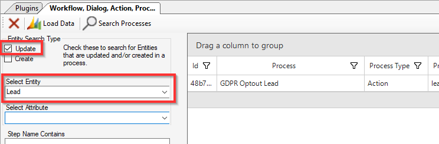

If I only search for processes that reference the Bookable Resource Entity, I
get 3 records.

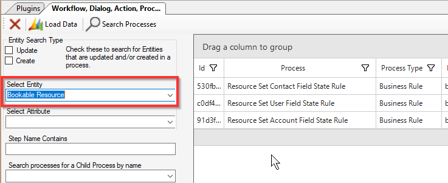

##### Attribute Search

The Attribute search can only be used in conjunction with a selected Entity.
Once an entity is selected. the Attribute list populates.

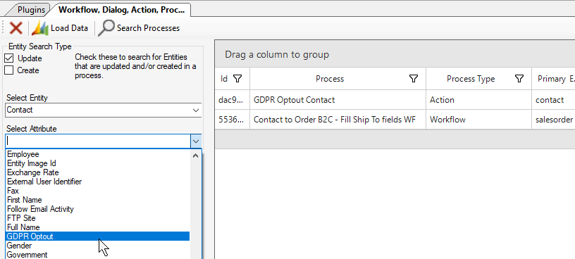

If I use the earlier Contact example from the Entity search, and select the GDPR
Optout Attribute. I only get the one process that Updates that Attribute of that
Entity.

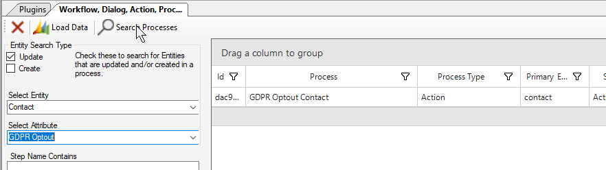

##### Step Name Contains Search

Does what it sounds like. You can search processes by the text in a step
description. Here is a Workflow that has “Update Description and Ship To Fields”
in one of the steps.

If I use that whole string in the search it results in finding the Workflow.

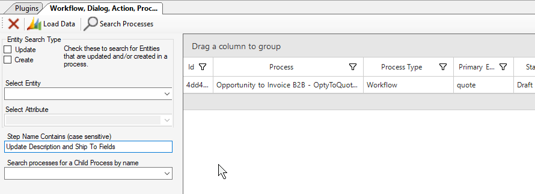

If I just search using “Update” I retrieve a few more.

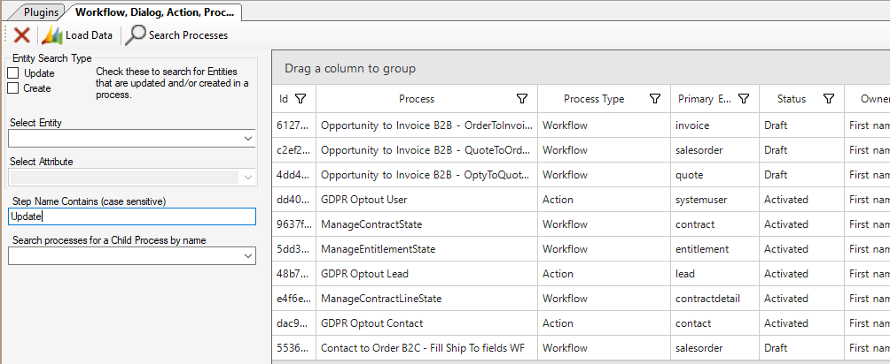

##### Child Process search

Search for Processes that call the selected process as a child process

##### Grid features

Future Features
---------------

### Search Features

Business rule JavaScript

Conditions

Custom WF Activities

Arguments

Process Properties

Process Type specific searching

### Grid Features

Status Bar Totals

Limitations
-----------

Cannot display memo type fields into the grid because of too much data load to
the screen.

Notes

Hardest part of the whole plugin was creating this .md document.
